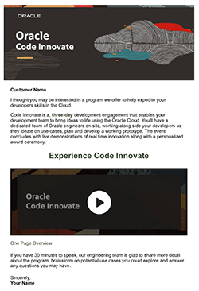

##  **In Person Code Innovate**
### **Step 1:** Access Code Innovate HTML Files
- If you are introducing customers to the Code Innovate program to align an event, please choose this HTML template:

  

- If your are positioning _Code Innovate_ to a customer,
  [leverage this template code.](https://github.com/chipbaber/codeinnovate_emailtemplate/blob/master/html/code-innovate-mailer-base64.html)

  You can preview this template [UI at this link.](https://chipbaber.github.io/codeinnovate_emailtemplate/html/code-innovate-mailer-base64.html)

- Once you have the registration email and Slack channel ready, please choose this HTML template:

  

- If your have an event already in place and are setting up the official registration [leverage and modify this template code.](https://github.com/chipbaber/codeinnovate_emailtemplate/blob/master/html/mailer_base64.html)

  You can preview this template [UI at this link.](https://chipbaber.github.io/codeinnovate_emailtemplate/html/mailer_base64.html)

- **Post Event (INTERNAL ONLY)**- If you would like to send out the Use Case videos you have recorded of the lightning talk presentations to the Account team or other Oracle employees, [leverage and modify this template.](https://github.com/chipbaber/codeinnovate_emailtemplate/blob/master/html/post_event_template_base64_6usecases.html)

You can preview this template [UI at this link.](https://chipbaber.github.io/codeinnovate_emailtemplate/html/post_event_template_base64_6usecases.html)
