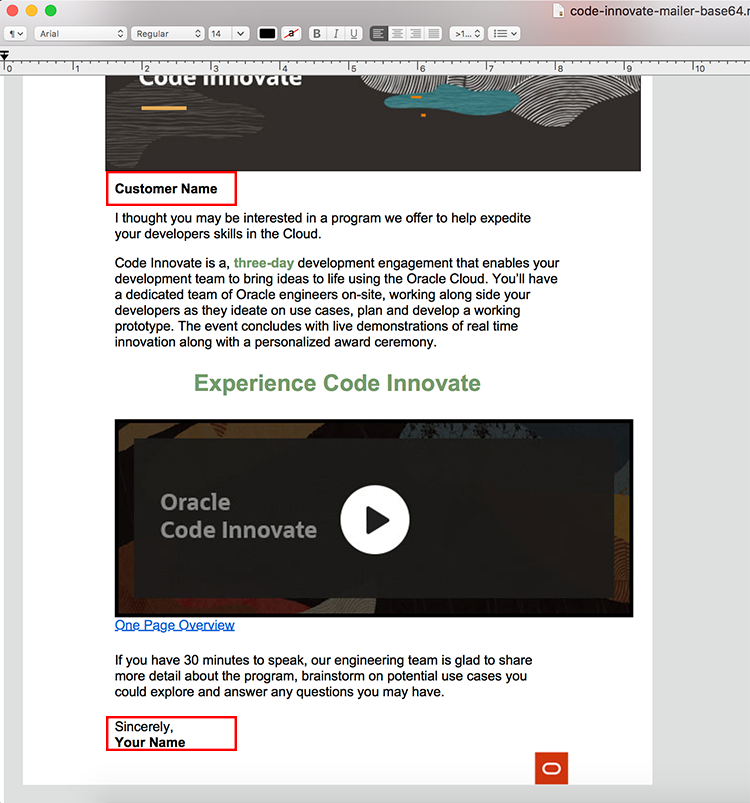

##  **In Person Code Innovate**
### **Step 1:** Access Code Innovate HTML Files
- If you are introducing customers to the Code Innovate program to align an event, please choose this HTML template:

  

- If your are positioning _Code Innovate_ to a customer,
  [leverage this template code.](https://github.com/chipbaber/codeinnovate_emailtemplate/blob/master/html/code-innovate-mailer-base64.html)

  You can preview this template [UI at this link.](https://chipbaber.github.io/codeinnovate_emailtemplate/html/code-innovate-mailer-base64.html)
## **Sending HTML Templates**

### **Step 1:** Download HTML Files

- Click on the **Raw** button to view the code.

      

- Press **Control-A** to select all text. Press **Control-C** to copy all text.

      

### **Step 2a:** Edit HTML in Thunderbird Email Client

- Open Thunderbird on your local machine and click the **Write** button.

      

- Inside the email client and **type in your subject**.

      

- Click on the message body.

      

- Select **Insert --> HTML** from the main menu.

      

- Press **Control-V** to paste in your HTML Copied in Step 1 and press **Insert**.

      

- In your email, type in the customers name in all the locations with the placeholder text **Customer Name**. You should see this text in the following locations.

      

- Make sure to change **Your Name** at the end as well.

      

- Send your email.

### **Step 2b:** Edit in Code Editor and Send through Thunderbird

- From the raw view of the HTML in Github, right-click and select
    **Save Page as**.

      

- Give the page a sensible name and select save.

      

- Go to your "Downloads" in Finder and open the page you just downloaded with TextEdit or any text editor you prefer.

      

- Make your modifications to the page, and save them.

      

- Now take your HTML code and do **STEP 2a** in order to send your HTML File.
