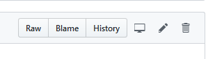
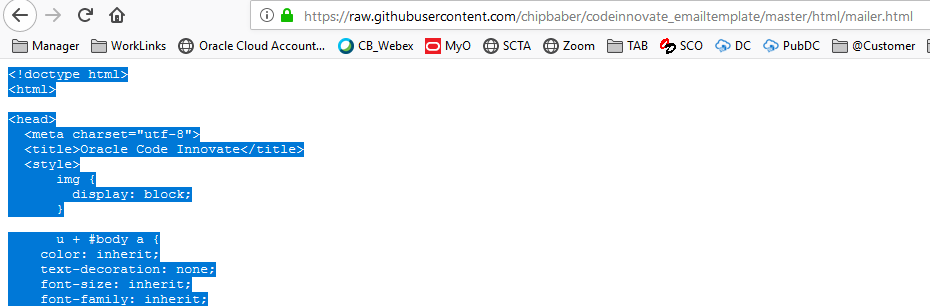
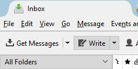
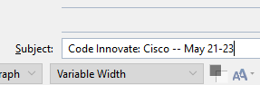
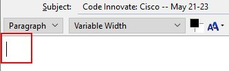
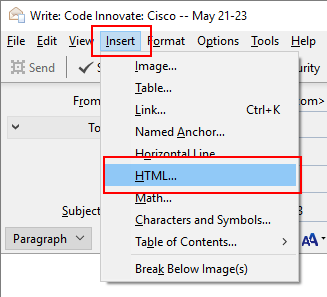
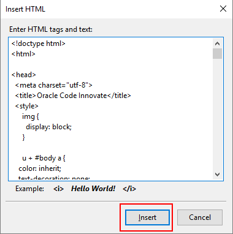
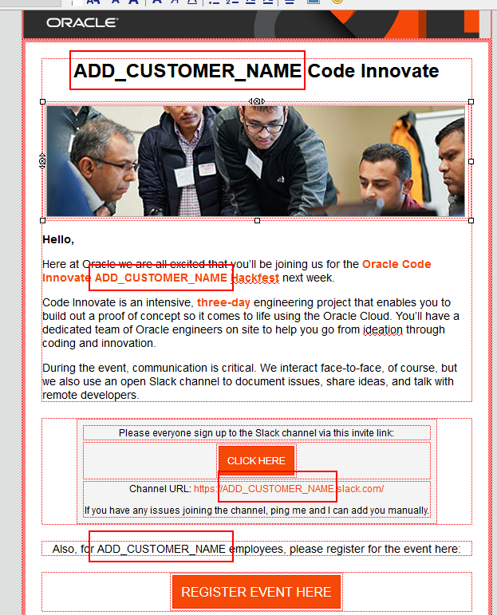

# Code Innovate Email Template
This folder contains a set of email friendly HTML Templates to be leveraged to invite folks to attend a Code Innovate event.

##Getting Started

###**Step 1:** Leveraging/Modifying the Template

- Navigate to [https://github.com/chipbaber/codeinnovate_emailtemplate/blob/master/html/mailer.html](https://github.com/chipbaber/codeinnovate_emailtemplate/blob/master/html/mailer.html)

- Click on the **Raw** button to view the code.

  

- Press **Control-A** to select all text. Press **Control-C** to copy all text.

  

### **Step 2:** Thunderbird Email Client Instructions

- Open Thunderbird on your local machine and click the **Write** button.

  

- Inside the email client and **type in your subject**.

  

- Click on the message body.

  

- Select **Insert --> HTML** from the main menu.

  

- Press **Control-V** to paste in your HTML Copied in Step 1 and press **Insert**.

  

- In your email, type in the customers name in all the locations with the placeholder text **ADD_CUSTOMER_NAME**. You should see this text in the following locations.

  

- **Double Click and modify the url location** in the following spots.

  

- Send your email.

### **Step 2a:** Outlook Email Client Instructions

- Add Steps

### **Step 3a:** Mac Email Client Instructions

- Add Steps
