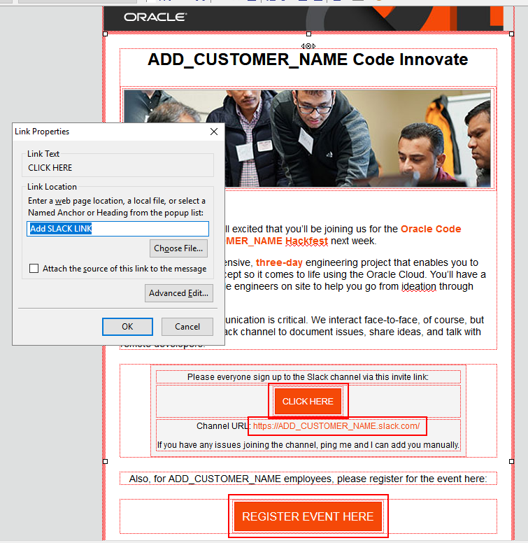
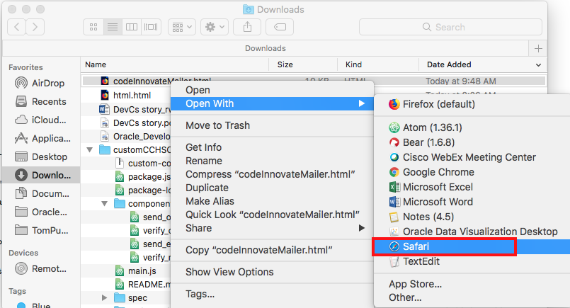

# Code Innovate Email Template
This folder contains a set of email friendly HTML Templates to be leveraged to invite folks to attend a Code Innovate event.

## Getting Started

### **Step 1:** Access the Templates/Copy HTML
We have two versions of each HTML template you can send to customers. The first is a base 64 version that embeds the image source as binary code in the email. The second access's imagery via url links. The base64 version would be the first choose for sending to customers.

- If you are introducing customers to the Code Innovate program to align an event please choose the HTML template:

  

  [https://chipbaber.github.io/codeinnovate_emailtemplate/html/eventoverview.html](https://chipbaber.github.io/codeinnovate_emailtemplate/html/eventoverview.html)

  The Base64 version is

  [https://chipbaber.github.io/codeinnovate_emailtemplate/html/eventoverview_base64.html](https://chipbaber.github.io/codeinnovate_emailtemplate/html/eventoverview_base64.html)

- If your have an event already in place and are setting up the official registration leverage and modify the template:

   Navigate to [https://github.com/chipbaber/codeinnovate_emailtemplate/blob/master/html/mailer.html](https://github.com/chipbaber/codeinnovate_emailtemplate/blob/master/html/mailer.html)

  Or navigate to base64 email [https://github.com/chipbaber/codeinnovate_emailtemplate/blob/master/html/mailer_base64.html](https://github.com/chipbaber/codeinnovate_emailtemplate/blob/master/html/mailer_base64.html).

- **Post Event (INTERNAL ONLY)**- If you would like to send out the Use Case videos you have recorded of the customers giving their presentations to the Account team or other Oracle employees, leverage and modify the template:

  Navigate to
[https://github.com/chipbaber/codeinnovate_emailtemplate/blob/master/html/use_case.htm](https://github.com/chipbaber/codeinnovate_emailtemplate/blob/master/html/use_case.htm)

  Or navigate to base 64 email
[https://github.com/chipbaber/codeinnovate_emailtemplate/blob/master/html/use_case_base64.htm](https://github.com/chipbaber/codeinnovate_emailtemplate/blob/master/html/use_case_base64.htm)

- Click on the **Raw** button to view the code.

  

- Press **Control-A** to select all text. Press **Control-C** to copy all text.

  

### **Step 2:** Thunderbird Email Client Instructions

- Open Thunderbird on your local machine and click the **Write** button.

  

- Inside the email client and **type in your subject**.

  

- Click on the message body.

  

- Select **Insert --> HTML** from the main menu.

  

- Press **Control-V** to paste in your HTML Copied in Step 1 and press **Insert**.

  

- In your email, type in the customers name in all the locations with the placeholder text **ADD_CUSTOMER_NAME**. You should see this text in the following locations.

  

- **Double Click and modify the url location** in the following spots.

  

- Send your email.

### **Step 2a:** Outlook Email Client Instructions

- Coming soon

### **Step 3a:** Mac Email Client Instructions

- From the raw view of the HTML in Github, right-click and select
**Save Page as**.

  

- Give the page a sensible name and select save.

  

- Go to your "Downloads" in Finder and open the page you just downloaded with TextEdit or any text editor you prefer.

  

- Make your modifications to the page, and save them.

  

- Return to finder and once again Right-Click on the mailer and select **Open With**, this time choose Safari. (This process will only work in Safari, it is NOT supported in chrome, firefox or anyother browser).

  

- With the page open in Safari navigate to the top menu bar and select **File --> Share --> Email This Page** (Your's will look slightly different)

  

- The mailer will open in Mail and you can send like any other E-mail.

  
