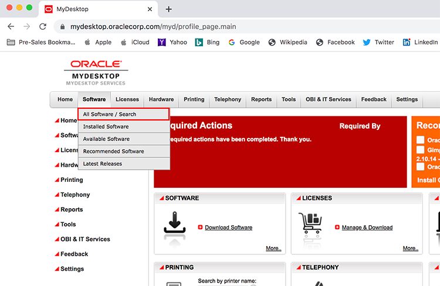
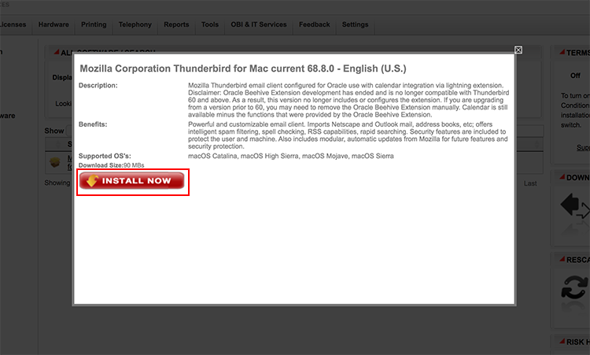

# **How to Set Up Thunderbird Email Client**
## **Step 1: Download Email Client**
  - Go to MyDesktop to download the most recent version of Thunderbird.
      
  - At the top of the page go to **Software** and select **All Software/Search** to go to the full list of Software available.
      
  - Then in the Search bar, type in *Mozilla Corporation Thunderbird* and select the one specific to your device.
      
  - Once you select the correct one, install that onto your device and follow the installation instructions.
      
### **Step 2: Set Up Thunderbird**
  - Once you have Thunderbird, set up the client to your oracle email.
  - To do this you will need to add your account, first type in your email address and password.
      
  - You will more than likely need to manually set up the account, in order to do this, you will need to enter in these specific ports for oracle email:
    - Incoming IMAP server: **stbeehive.oracle.com** Port: **993**  Connection: **SSL**
      
    - Outgoing SMTP server: **stbeehive.oracle.com** Port: **465**  Connection: **SSL**
          
    - (**If Needed**): LDAP Directory server: **ldap.oracle.com** Port: **636** Connection: **SSL**
      

### **Step 3: Send an Email**
  - Now that you have your email client set up, test sending an HTML file from [here](https://chipbaber.github.io/codeinnovate_emailtemplate/?lab=virtual-code-innovate-email-templates):

      
