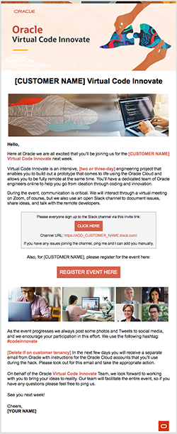

##  **Virtual Code Innovate**
### **Step 1:** Access Code Innovate HTML Files

- If you are introducing customers to the Virtual Code Innovate program to align an event, please choose this HTML template:

  

- If your are positioning _Virtual Code Innovate_ to a customer,
  [leverage this template code.](https://github.com/chipbaber/codeinnovate_emailtemplate/blob/master/html/virtual-code-innovate-onepager.html)

  You can preview this template [UI at this link.](https://chipbaber.github.io/codeinnovate_emailtemplate/html/virtual-code-innovate-onepager.html)

- Once you have the registration email and Slack channel ready, please choose this HTML template:

  

- If your have an event already in place and are setting up the official registration [leverage and modify this template code.](https://github.com/chipbaber/codeinnovate_emailtemplate/blob/master/html/virtual-code-tinnovate-registration.html)

  You can preview this template [UI at this link.](https://chipbaber.github.io/codeinnovate_emailtemplate/html/virtual-code-tinnovate-registration.html)

- **Post Event (INTERNAL ONLY)**- If you would like to send out the Use Case videos you have recorded of the lightning talk presentations to the Account team or other Oracle employees, [leverage and modify this template.](https://github.com/chipbaber/codeinnovate_emailtemplate/blob/master/html/Virtual_Code_Innovate_Post_Event_HTML_Template.html)

You can preview this template [UI at this link.](https://chipbaber.github.io/codeinnovate_emailtemplate/html/Virtual_Code_Innovate_Post_Event_HTML_Template.html)
