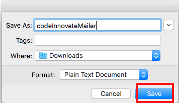
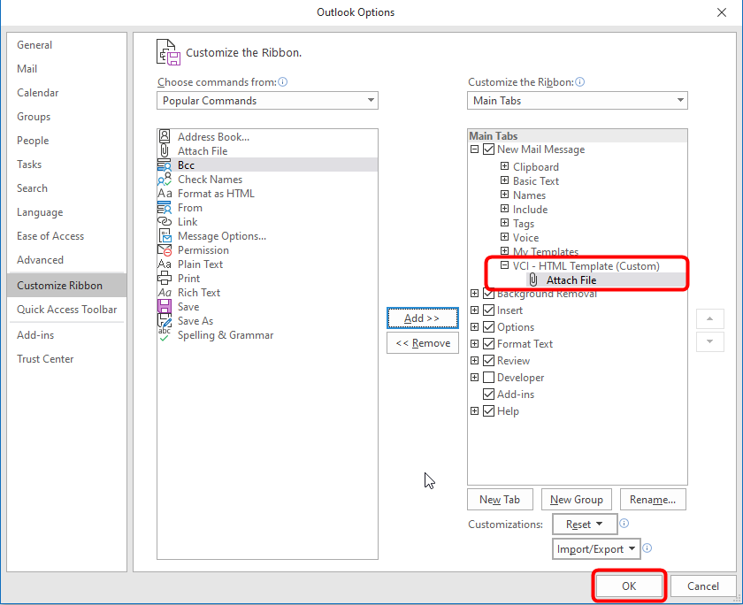

##  **Data Innovate**
### **Step 1:** Access Data Innovate email HTML Files

- If your are positioning _Data Innovate_ to a customer, you will first need to determine your target persona. Then based on the persona pick the appropriate email to send. below is the default messaging for each persona.

|  Existing ADW customer | Data Scientist (New Customer)| Data Scientist (Existing Customer)| ADW & Data Science |
|:---:|:---:|:---:|:---:|
| | | |  |
| <a href="https://chipbaber.github.io/codeinnovate_emailtemplate/html/data_innovate_ExistingADW.html" target="_di">Preview</a> | <a href="https://chipbaber.github.io/codeinnovate_emailtemplate/html/data_innovate_ExistingLimitedDS.html" target="_di"> Preview </a>  | <a href="https://chipbaber.github.io/codeinnovate_emailtemplate/html/data_innovate_ExistingNoDS.html" target="_di">Preview</a>  | <a href="https://chipbaber.github.io/codeinnovate_emailtemplate/html/data_innovate_NewCustomers.html" target="_di"> Preview </a>  |   
| [ Get Email Code ](https://github.com/chipbaber/codeinnovate_emailtemplate/blob/master/html/data_innovate_ExistingADW.html)  | [ Get Email Code ](https://github.com/chipbaber/codeinnovate_emailtemplate/blob/master/html/data_innovate_ExistingLimitedDS.html)  | [ Get Email Code ](https://github.com/chipbaber/codeinnovate_emailtemplate/blob/master/html/data_innovate_ExistingNoDS.html)  |  [Get Email Code](https://github.com/chipbaber/codeinnovate_emailtemplate/blob/master/html/data_innovate_NewCustomers.html) |   

## **Sending HTML Templates Using Thunderbird**

### **Step 1:** Download HTML Files

- Click on the **Raw** button to view the code.

    

- Press **Control-A** to select all text. Press **Control-C** to copy all text.

    

### **Step 2a:** Edit HTML in Thunderbird Email Client

- Open Thunderbird on your local machine and click the **Write** button.

    

- Inside the email client and **type in your subject**.

    

- Click on the message body.

    

- Select **Insert --> HTML** from the main menu.

    

- Press **Control-V** to paste in your HTML Copied in Step 1 and press **Insert**.

    

- In your email, type in the customers name in all the locations with the placeholder text **Customer Name**. You should also add times that reflect your availability. And don't forget to put your name at the end.

    

- Send your email.

### **Step 2b:** Edit in Code Editor and Send through Thunderbird

- From the raw view of the HTML in Github, right-click and select
  **Save Page as**.

    

- Give the page a sensible name and select save.

    

- Go to your "Downloads" in Finder and open the page you just downloaded with TextEdit or any text editor you prefer.

    

- Make your modifications to the page, and save them.

    

- Now take your HTML code and do **STEP 2a** in order to send your HTML File.

## **Sending HTML Templates Using Outlook**

### **Step 1:** Sending HTML Emails using Outlook on Windows 10

This step will detail how-to customize the ribbon on the New Email window to include an Attach File, Insert Text Button.  

  - Open Outlook and click the **New Email** on the **Home** tab.

    

  - In the new email window, on the **Message** tab, right-click in an open space on the right-side of the ribbon and select **Customize the Ribbon...**.

    

  - In the **Outlook Options** window, right-click on the **New Mail Message** tab and select **Add New Group**.

    

  - A new custom group is added under the **My Templates** group.  Right-click on **New Group (Custom)** and select **Rename**.

    

  - Enter the desired **Display Name** and click **OK**.

    

  - The **VCI - HTML Template** group should already be selected, select the command **Attach File** and click the **Add** button in the middle.

    

  - You will now see the command **Attach File** under the the group **VCI - HTML Template**, click **OK** to return to the new email window.

    

  - You will now see ribbon contains the new group **VCI - HTML Template**.

    

### **Step 2: Insert HTML Template into Email Body**

Once the ribbon is customized, you are ready to insert an HTML Template into the body of the email.

  - Click on **Attach File** in the group **VCI - HTML Template**.

    

  - Select the desired HTML file/template, click on the **Insert** dropdown in the bottom-right and select **Insert as Text**

    

  - Now you are ready to modify the contents of the email accordingly before you send it.

    
