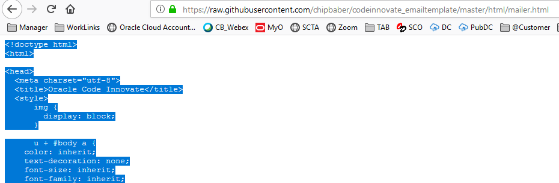
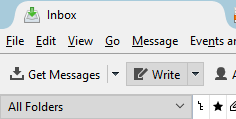
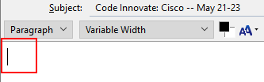
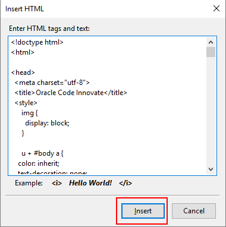
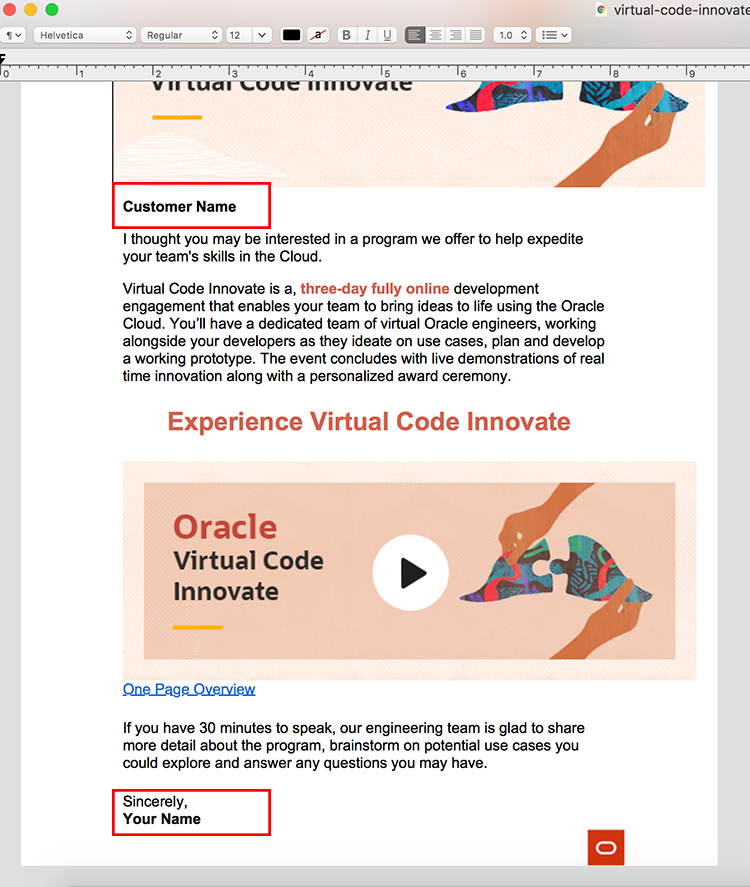

##  **Data Innovate**
### **Step 1:** Access Data Innovate email HTML Files

- If you are introducing customers to the Virtual Code Innovate program to align an event, please choose one of the HTML templates below:

  

- If your are positioning _Data Innovate_ to a customer, you will first need to determine your persona. Then based on the persona pick the appropriate email to send.
  For the Existing ADW customer, [ leverage this template](https://github.com/chipbaber/codeinnovate_emailtemplate/blob/master/html/data_innovate_ExistingADW.html) <a href="https://chipbaber.github.io/codeinnovate_emailtemplate/html/data_innovate_ExistingADW.html" target="_di"> here.</a>

  For the Data Scientist, new customer, [ leverage this template](https://github.com/chipbaber/codeinnovate_emailtemplate/blob/master/html/data_innovate_ExistingLimitedDS.html) <a href="https://chipbaber.github.io/codeinnovate_emailtemplate/html/data_innovate_ExistingLimitedDS.html" target="_di"> here.</a>

  For the Data Scientist, existing customer persona,  [ leverage this template](https://github.com/chipbaber/codeinnovate_emailtemplate/blob/master/html/data_innovate_ExistingNoDS.html) <a href="https://chipbaber.github.io/codeinnovate_emailtemplate/html/data_innovate_ExistingNoDS.html" target="_di"> here.</a>

  For the new to ADW/Data Science customer, [ leverage this template](https://github.com/chipbaber/codeinnovate_emailtemplate/blob/master/html/data_innovate_NewCustomers.html) <a href="https://chipbaber.github.io/codeinnovate_emailtemplate/html/data_innovate_NewCustomers.html" target="_di"> here.</a>

## **Sending HTML Templates**

### **Step 1:** Download HTML Files

- Click on the **Raw** button to view the code.

    

- Press **Control-A** to select all text. Press **Control-C** to copy all text.

    

### **Step 2a:** Edit HTML in Thunderbird Email Client

- Open Thunderbird on your local machine and click the **Write** button.

    

- Inside the email client and **type in your subject**.

    

- Click on the message body.

    

- Select **Insert --> HTML** from the main menu.

    

- Press **Control-V** to paste in your HTML Copied in Step 1 and press **Insert**.

    

- In your email, type in the customers name in all the locations with the placeholder text **Customer Name**. You should also add times that reflect your availability. And don't forget to put your name at the end. 

    

- Send your email.

### **Step 2b:** Edit in Code Editor and Send through Thunderbird

- From the raw view of the HTML in Github, right-click and select
  **Save Page as**.

    

- Give the page a sensible name and select save.

    

- Go to your "Downloads" in Finder and open the page you just downloaded with TextEdit or any text editor you prefer.

    

- Make your modifications to the page, and save them.

    

- Now take your HTML code and do **STEP 2a** in order to send your HTML File.
