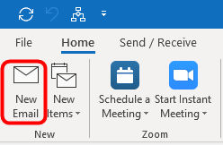
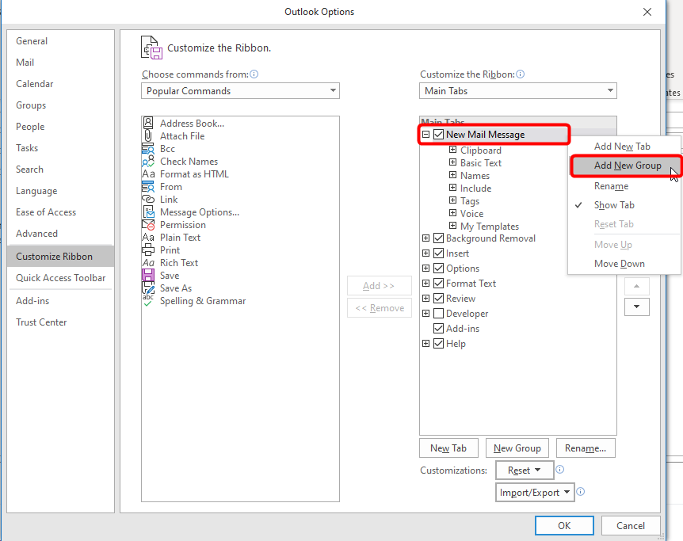
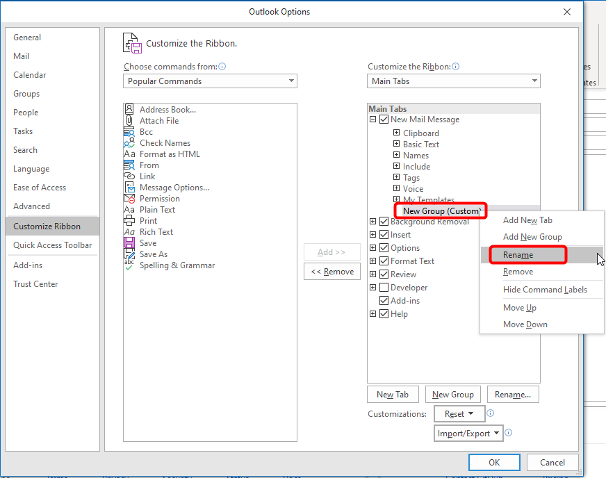

# **How-to setup Outlook on Windows 10 to send Emails using HTML Templates.

## **Step 1: Customize the Send Email Ribbon 

This step will detail how-to customize the ribbon on the New Email window to include an Attach File, Insert Text Button.

  - Open Outlook and click the **New Email** on the **Home** tab.

    

  - In the new email window, on the **Message** tab, right-click in an open space on the right-side of the ribbon and select **Customize the Ribbon...**.

    

  - In the **Outlook Options** window, right-click on the **New Mail Message** tab and select **Add New Group**.

    

  - A new custom group is added under the **My Templates** group.  Right-click on **New Group (Custom)** and select **Rename**.

    

  - Enter the desired **Display Name** and click **OK**.

    

  - The **VCI - HTML Template** group should already be selected, select the command **Attach File** and click the **Add** button in the middle.

    

  - You will now see the command **Attach File** under the the group **VCI - HTML Template**, click **OK** to return to the new email window.

    

  - You will now see ribbon contains the new group **VCI - HTML Template**.

    

### **Step 2: Insert HTML Template into Email Body**

Once the ribbon is customized, you are ready to insert an HTML Template into the body of the email.

  - Click on **Attach File** in the group **VCI - HTML Template**.

    

  - Select the desired HTML file/template, click on the **Insert** dropdown in the bottom-right and select **Insert as Text**

    

  - Now you are ready to modify the contents of the email accordingly before you send it.

    

